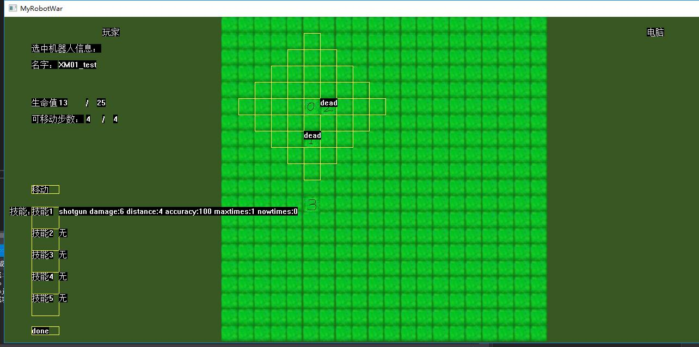

# 个人分报告
姓名：冯炀
学号：3170101202
## 一、分工任务及解决方案
### 1.1分工任务
+ Model层编程和部分Commen层的类定义
+ 参与各轮迭代的调试工作
+ 编写小组报告

### 1.2解决方案
+ 将各类基础数据在Commen层中定义
+ Model层中先分别写出各种判定逻辑的函数代码，然后使用一个总的Model类进行整合。Model类的类函数可直接根据Viewmodel层的命令执行对应操作，而一个逻辑函数可能会被不同操作函数调用

## 二、设计思路及实现过程
### 2.1部分Commen层定义
完成了oneRobot类的初步定义，该类由同组的韩耕诗同学根据显示需要进一步完善，代码在该同学的个人报告中有，这里不再放出。完成了Robotskill类的定义，代码如下：
'''
class Robotskill {
public:
	Robotskill(char* na,int dmg,int dis,int acc,int mtimes);
	char* getname();
	int getdamage();
	int getdistance();
	int getaccuracy();
	int getmaxtimes();
	int getnowtimes();
	bool useskill();
	void use();
private:
	char name[20];
	int damage;
	int distance;
	int accuracy;
	int maxtimes;
	int nowtimes;
};
'''

### 2.2Model层编写
Model由Model类整合其他函数，由gameinit和stageinit完成游戏和关卡的初始化，即用函数从文件读入对应数据并储存在对应的vector或类中，文件中各数值使用#号分开；由querry函数根据Viewmodel层传来参数执行对应操作，querry函数调用了Model类定义的其他判定函数来完成此操作；Model类有三个private变量，分别为储存地图数据的gamemap类变量gmap、储存了本关卡内玩家和电脑的棋子数据的Robotlist类数组变量playerlist[2]和储存当前选中坐标数据的location类变量selected。

gamemap类由用于初始化的setmap函数和setrobotmap函数、用于执行移动操作的move函数、判定对应坐标点是否有棋子的判定函数和获取坐标点棋子编号的函数以及一个int型的数组map组成。根据map数组中储存的编号可以从playerlist数组中获取对应的棋子信息。

Robotlist类由初始化函数、返回对应变量值的函数、用于判断棋子是否完成回合的vector变量、储存棋子信息的Robotdata类vector变量以及储存棋子位置的Robotdata类变量组成。gamemap类中map数组内储存的编号对应的是三个vector类中对应棋子的编号。

location和Robotdata类分别用于定义位置数据和棋子数据，定义如下
'''
class location {
public:
	void setlocation(int m, int n);
	int getlocationx();
	int getlocationy();
private:
	int x;
	int y;
};
class Robotdata {
public:
	Robotdata(char* na, int mhp, int nhp, int range, int sp, int de);
	int getmaxhp();
	int getnowhp();
	int getmoverange();
	int getspeed();
	int getdefense();
	int changehp(int change);
	void Move(int m);
	int getcanmove();
	char* getname();
	void setskill(vector<int>skilltype);
	int getskillnum();
	Robotskill&getskillinfo(int num);
private:
	char name[20];
	int maxhp;
	int nowhp;
	int moverange;
	int canmove;
	int speed;
	int defense;
	vector<Robotskill> skill;
};
'''

### 2.3调试过程
在调试过程中主要存在问题在于部分函数逻辑出现错误，根据运行结果进行了修正。

## 三、图表说明及运行效果图
在前两次迭代中，由于我们注重于程序的各功能正常实现，故除了修复bug外没有对我负责部分的代码进行改动，运行效果如下

在后续迭代中，为了增加显示内容，对我负责部分的代码进行了部分修改，并加入开始界面和胜利及失败时的提示信息

## 四、本课程心得体会

在本课程中，我了解了用于大型程序开发的MVVM框架，也通过编写一个较为大型的程序进行了相应的编程实践，体会到了一人编写小程序与多人协作编程的不同，尤其是多人协作中要尽量让各人负责的工作之间联系较小，避免因为一个人的进度或者程序bug影响其他人的编程进度。

## 五、对课程的改进意见
在对MVVM框架的理解中，虽然老师结合案例讲了框架的实现方法，但是理解起来还是要花很长时间，希望老师能够讲的更具体一点，比如具体到功能名称及其所在层。