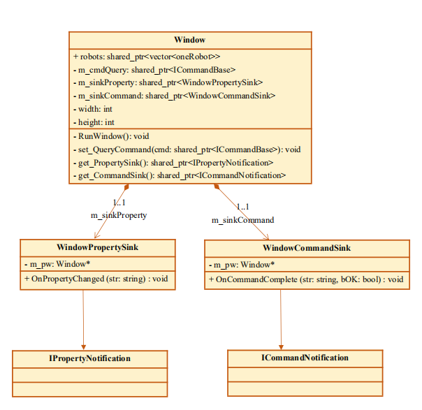
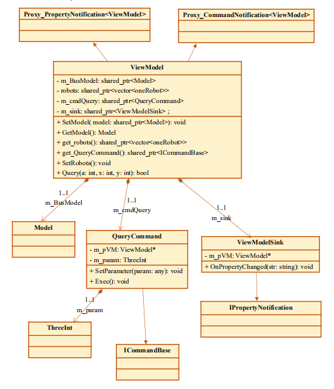

# 个人分报告

姓名：韩耕诗

学号：3170103236

## 一、分工任务及解决方案

### 1.1 分工任务

* RobotWar小游戏工程的View层编程
* ViewModel层编程
* 部分Common层的类定义
* 编写App层实现调用各层，完成整合
* 绘制RobotWar工程的系统分层图以及静态类图
* 尝试用Appveyor进行持续集成，与另一组员用其他持续集成工具的尝试作对比
* 参与各轮迭代的调试工作

### 1.2 解决方案

* View层的图形化界面通过尝试一些外部图形插件实现，如Qt, EasyX等。
* ViewModel层主要包含实现从model层的数据到view层的数据的转换函数的类，完成类定义以及函数声明后可以更快完成ViewModel层的编码。
* Common层可以定义参数的类，用来作为传递命令的数据类型。
* App层对各层之间的整合可以参考学习老师给出的样例，主要是调用View层的时候要注意与实际的Window类等定义相符合。
* 分层图在工程开始是即可成功绘制初稿，结束后可根据终稿进行修改，以及静态类图可以通过LaTeX或者其他画流程图软件等完成，最后生成PDF格式的文件。
* 使用Appveyor持续集成可以在网上找到对应的教程，分别用网页版和本地版进行尝试。
* 调试用Visual Studio 2017进行编译运行，主要注意C++语言标准的选择以及图形库的建立和使用。

## 二、设计思路及实现过程

### 2.1 View层实现

​		首先是选择图形化的方式，经过尝试Qt、GTK、EasyX等方式后，我选择了使用EasyX的图形库来实现。选择它的主要原因是它的体积比较小，在安装和运行上成功实现图形化界面，而且也可以做出比较丰富的界面。View层的图形化显示主要由其中的Window类实现，在调用EasyX的graphics.h库中的函数基础上，通过鼠标点击等事件相应修改命令参数，并且传递命令。

​		同时，View层还有继承了属性通知类的Window属性接收器类WindowPropertySink，以及继承了命令通知类的Window命令接收器类WindowCommandSink，主要用于实现通知和命令的接收器的功能。另外还有属性绑定，使得各层之间可以传递属性值。View层代码过多，就不再附上代码，如下图可以从类图中可以清楚地看到继承关系。



### 2.2 ViewModel层实现

​		ViewModel层是View层的抽象，主要负责View层和Model层之间信息转换，同时将View的Command传递到Model层，使Model层进行相应的逻辑处理。

​		用共享指针shared_ptr对一些属性进行绑定是实现ViewModel层与View层之间交互的有效方式，Command实际上就是绑定操作的调用，以及属性改变时会有相关通知发送给View层使之相对应的接收并改变图形界面显示。

​		另外，ViewModel层和Model层之间的连接就更加直接了。ViewModel层需要聚合Model层的对象，在使用MVVM编程模型的这次工程中，ViewModel可以通过包含头文件直接调用Model层中的Model类，从而通过接收函数在Model层时间触发时接受信息，改变相应绑定属性，传递通知到View层。

​		因此，ViewModel层大部分内容都是转换函数或者调用函数。ViewModel层有数个头文件和源文件，不再附上代码，如下图是ViewModel层的类图。



### 2.3 部分Common层实现

​		在RobotWar小游戏工程中，命令的传递需要相对应的参数，这次我和队友经过讨论，认为需要定义一个由三个整数组成的类来作为命令的相关参数。我编写了ThreeInt类，主要包含三个整数的读和写等成员函数。

​		另外，我们的游戏中，View层图形化显示的一个小单位是一个Robot，所以我在Common层中也定义了oneRobot类，实现一个机器人的显示数据的设置和更改，以及对应的部分显示函数。可以减轻View层中Window类相关函数的实现复杂程度。

​		以下是我在Common层中定义的两个类的声明。

```c++
class ThreeInt
{
private:
	int a;
	int b;
	int c;
public:
	int get_a() { return a; }
	int get_b() { return b; }
	int get_c() { return c; }
	void setThreeInt(int ta, int tb, int tc) { a = ta; b = tb; c = tc; }
	void set_a(int ta) { a = ta; }
	void set_b(int tb) { b = tb; }
	void set_c(int tc) { c = tc; }
};

class oneRobot
{
private:
	int x;
	int y;				//机器人在场景中的坐标
	int id;				//机器人编号，即图片编号
	string name;		//机器人名字
	int currentlife;	//当前生命值
	int wholelife;		//原本的生命值
	vector<Robotskill> skills;	//技能名字以及描述
	int steps;			//剩余可移动步数
	int wholesteps; 	//原本的步数
	bool done;			//是否已经完成了对该机器人的操作，每个回合对一个机器人只能确认操作一次
	bool chosen;		//是否当前被选中
public:
	void Setchosen(bool c);
	void SetoneRobot(int tx, int ty, int id, string tname, int tcl, int twl, 
		vector<Robotskill>& tskills, int ts,int tws, bool tdone, bool tchosen)throw();
	void ShowoneRobot();
	void ShowOneCpuInfo(int num);
	int getid() { return id; }
};
```


### 2.4 App层实现

​		App层的实现主要是整合各个层，完成整体功能呈现，可以算是整个工程的顶层。App层中只有一个App类，主要包括了Init函数和Show函数。Init初始化函数调用各个层，实现了属性绑定、命令绑定和通知设定等。而Show函数就是调用了View层中的Window类的运行函数，实现整个工程的运行。如下是我在App层中对App类的定义。

```c++
class App
{
public:
	App();
	~App() throw();
	bool Init();
	void Show();
private:
	Window  m_wndMain;
	std::shared_ptr<ViewModel>  m_spViewModel;
};
```


### 2.5 分层图及静态类图绘制

​		分层图和静态类图绘制还是比较简单的，在了解学习工程层次以及观察全部代码的基础上，可以很快完成，并且导出为PDF文件，上传到GitHub仓库上。静态类图过长，下图展示分层图：


### 2.6 Appveyor实现持续集成尝试

​		我在通过网上的学习后尝试了使用Appveyor进行持续集成的尝试。分别尝试了本地版本和网页版本。在尝试本地版本的Appveyor时，虽然能够和GitHub的仓库相连接，但是无法进入settings设置。因此，我又尝试了在网页上进行Appveyor持续集成，成功完成了和GitHub仓库的连接以及settings配置，在用简单的代码测试后发现可以成功通过。但是正在将我们完整的小游戏工程文档传上GitHub仓库后，发现因为C++语言标准难以设置的问题，Appveyor在编译过程中报了我们在之前自己调试中就已经发现的语法错误，而这类错误需要设置C++17的语言标准，这在Appveyor中很难设置，我也没能够在网上找到相应的教程。因此我们后来在持续集成中，虽然Appveyor报了相关错误，不过我们自己看的时候过滤这类错误，也能够一定程度上完成持续集成的实现。

​		如下图可以看到，Appveyor报错主要是因为C++17语言标准没有设置好。


### 2.7 调试过程

​		调试过程有几个阶段。刚开始我们因为对于MVVM模型的不熟悉，在属性绑定以及通知机制和各层分层等问题上面花了很多时间。后来，在老师和同学们的帮助下，我们成功分层，按照MVVM的模式进行进一步开发和改进调试等工作。

​		另外，在调试时我们报了一些语法错误，后来经过老师指导发现是C++语言标准没有设定为17，在Visual Studio 2017的工程中设定为C++17标准后成功解决了这类问题。

​		还有就是通过整体编译运行后的事迹使用，找到了很多图形界面的需要改进的地方，还有暴露出来的一些位于Model层的逻辑控制问题，经过共同调试改正，完成多轮迭代。

## 三、图表说明及运行效果图

​		在View层中我选用EasyX的图形库实现图形化界面，提高人机交互效果。

​		下图为实现一轮迭代的简单图形化界面：


​		后面经过改进View层的代码，以及替换了机器人的图片，实现了更完整的图形化界面，如下图：


​		最后经过讨论，我在View层对机器人的攻击效果有所改进，并且负责Model层的同学对机器人输入数据增多，实现了机器人数量更多的游戏界面，并且我加入了获胜或者是失败的图片显示，更加直观，效果如下图：


## 四、本课程心得体会

​		在学习C++项目管理及工程实践这门课程的过程中，我学会了很多关于C++编程需要注意的地方。在小组协作的过程中，我们学会了MVVM的分层编程框架，并且成功地完成了我们的RobotWar小游戏。并且，在学习的过程中，我也学到了很多关于C++编程的优化需要注意的方面。在编程实践的过程中，我们遇到了一些问题，老师同学们都对我们有很大的帮助。虽然大家做的是不一样的题目，但是共同点还是很多的，而且在我去询问时都会耐心地解答。总的来说，这次的小学期课程不论在学习知识的方面，还是协作编程的方面，对我们的能力提升都是有很大帮助的。

## 五、对课程的改进意见

​		在学习以及编程实现的过程中，我们前半段时间关于MVVM等编程模型的实现花费了很长时间才理解，而且在实现中也遇到了很多相关问题，希望老师能够在关于这些编程模型，尤其是MVVM模型的具体实现上能够通过更多具体的例子来讲解。

